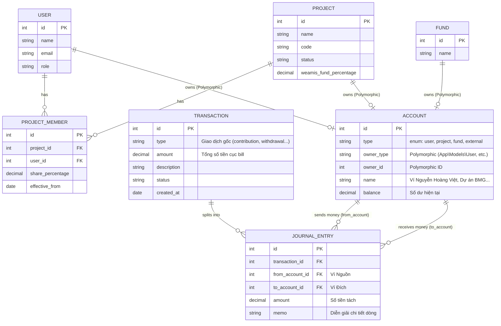

# Weamis Money Database ERD

Sơ đồ Thực thể Liên kết (ERD) mô tả kiến trúc Kế toán kép (Double-Entry Bookkeeping) mới của hệ thống.

### Chú thích thiết kế mới:
1. **Polymorphic Accounts (Ví Đa hình):** Thay vì bảng giao dịch gán trực tiếp cho User hay Project, giờ đây `User`, `Project`, và `Fund` đều sở hữu một `Account` (Ví) của riêng mình.
2. **Tách Giao dịch (Split Transactions):** Một `Transaction` (ví dụ bill chuyển khoản ngân hàng 3 triệu) sẽ sinh ra nhiều dòng `Journal Entry` (Bút toán kép), giúp điều hướng số tiền chính xác từ Ví Ngân Hàng sang Ví của nhiều Dự án khác nhau.
3. **Tính toán Số dư (Balance):** Mọi công thức tính cổ phần, tài sản ròng giờ đây chỉ cần Query tổng thu chi trên bảng `Journal Entry` thuộc về `Account` tương ứng, tuân thủ đúng chuẩn OOP Factor-based.
