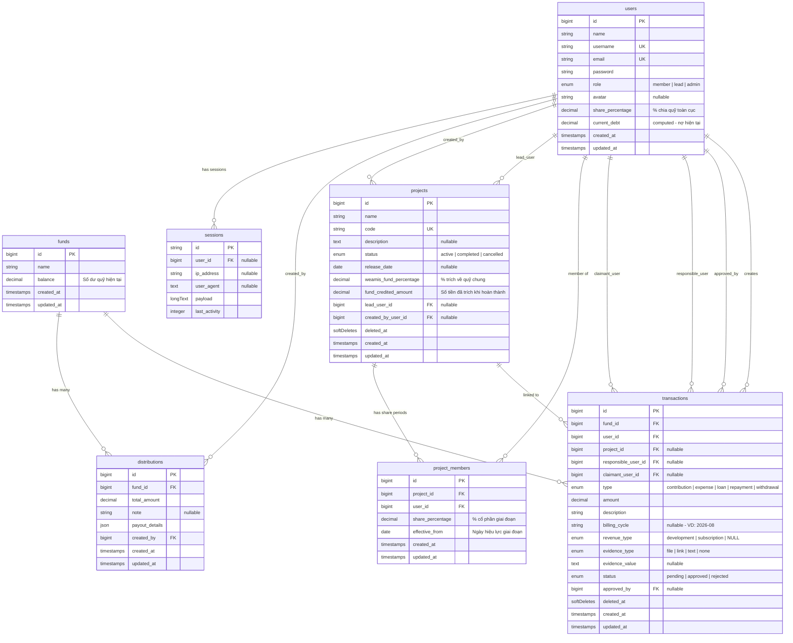

# Weamis Money — Entity Relationship Diagram (ERD)

> Schema sau khi cập nhật: **Temporal Shares** + **Revenue Type** + **Cleanup total_profit**

---

## Tóm Tắt Thay Đổi Schema

| Thay đổi | Bảng | Chi tiết |
|---|---|---|
| ✅ **Thêm** | `project_members.effective_from` | Ngày hiệu lực cổ phần → hỗ trợ cổ phần thay đổi theo thời gian |
| ✅ **Thêm** | `transactions.revenue_type` | `development` / `subscription` → tách tiền phát triển & thuê bao |
| ✅ **Xóa** | `funds.total_profit` | Không còn ý nghĩa sau khi bỏ Túi Thần Tài |
| ✅ **Thay đổi** | `project_members` UNIQUE | Từ `(project_id, user_id)` → `(project_id, user_id, effective_from)` |

## Đánh Giá 3NF

| Tiêu chí | Kết quả |
|---|---|
| 1NF - Mọi giá trị là atomic | ✅ Đạt (trừ `distributions.payout_details` là JSON, chấp nhận được) |
| 2NF - Không phụ thuộc một phần | ✅ Đạt |
| 3NF - Không phụ thuộc bắc cầu | ⚠️ `funds.balance` và `users.current_debt` là computed → **denormalization có chủ đích** (performance trade-off) |

> [!NOTE]
> Schema hiện tại đạt chuẩn **3NF với denormalization hợp lý** — `funds.balance` được giữ lại để tránh tính lại từ hàng trăm transactions mỗi request.
